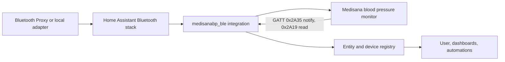
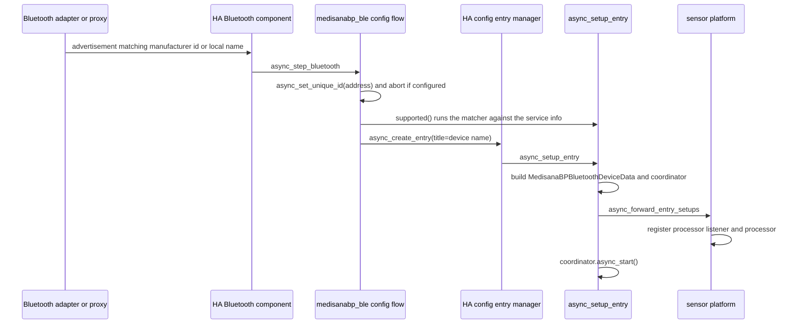
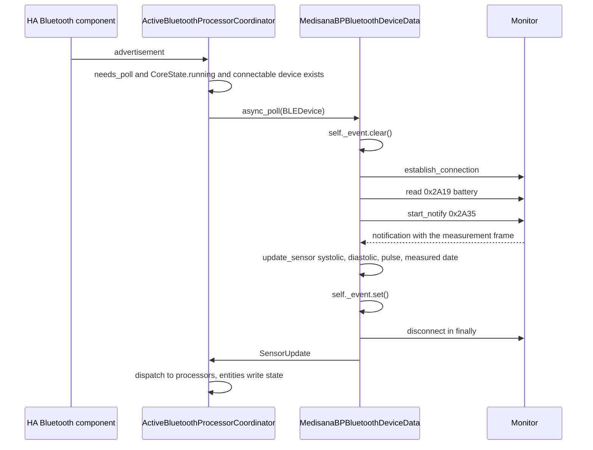

# Architecture Concept Document (ACD)

**Integration:** `medisanabp_ble` — Medisana Blood Pressure BLE
**Repository:** <https://github.com/acdcnow/Medisanabp_ble> (fork of <https://github.com/bkbilly/medisanabp_ble>)
**Audited revision:** `bf505a7` ("Update parser.py", `main`)
**Target platform:** Home Assistant 2026.9 (core 2026.9.3 / Python 3.14)
**Document status:** architecture of record for the HA 2026.9 audit branch (`ha-2026.9-audit`, integration version 1.4.0)

Related documents:

| Document | Content |
| --- | --- |
| [System Design Document](System-Design-Document.md) | classes, data model, function inventory, runtime flows |
| [Home Assistant 2026.9 Compatibility Report](Home-Assistant-2026.9-Compatibility-Report.md) | evidence, findings, fixes, open items |
| [GitDiagram](https://gitdiagram.com/acdcnow/Medisanabp_ble) | generated component graph of the default branch |

---

## 1. Purpose and scope

The integration brings a Medisana blood pressure monitor (Bluetooth LE, GATT Blood Pressure Service) into Home Assistant as a *device* with six sensors: systolic, diastolic, pulse, battery, signal strength and measured date.

### In scope

* Automatic discovery of supported monitors through the Home Assistant Bluetooth stack (local adapter or ESPHome proxy).
* One config entry per physical device, created from a discovery flow or from a manual device picker.
* Active retrieval of the measurement (the device only volunteers it over a subscribed characteristic, not in its advertisement).
* Passive retrieval of RSSI from advertisements.
* Home Assistant entities, device registry entry and translated UI strings.

### Out of scope

* Writing anything back to the device (no time synchronisation, no user/memory slot management, no measurement triggering).
* Historical measurement upload — the device stores up to 200 measurements, the integration only consumes the latest one that the device pushes after a connection.
* Cloud or vendor app integration.
* Multi-device grouping (e.g. per-user profiles of a single monitor).

---

## 2. Stakeholders and use cases

| Stakeholder | Concern | Use case |
| --- | --- | --- |
| Home Assistant user | zero-config device onboarding | UC-1: monitor is discovered, confirmed in one dialog, sensors appear |
| Home Assistant user | trustworthy measurements | UC-2: after each measurement the three values plus the device-side timestamp update within ~15 s |
| Home Assistant user | battery visibility | UC-3: battery percentage is refreshed on every poll |
| Home Assistant user | automations | UC-4: notifications/dashboards use `sensor.*_systolic` etc. without polling HA |
| Integration maintainer | low support load | UC-5: no YAML, no manual restart, failures are visible in the log with one clear cause |
| Home Assistant core | no resource leaks | UC-6: a Bluetooth connection is never left open, unload/reload is clean |

---

## 3. System context

### Interfaces

| Interface | Direction | Detail |
| --- | --- | --- |
| BLE advertisement | in | Discovery only. No measurement data is present in the advertisement. |
| BLE GATT `0x2A35` Blood Pressure Measurement | in | Notifications enabled by the integration after connecting; the device answers with one measurement frame. |
| BLE GATT `0x2A19` Battery Level | in | Plain read on every poll. |
| HA `bluetooth` component | in | Discovery, adverts, connectable `BLEDevice` resolution, active-update processor. |
| HA config entry + platform API | in/out | `async_setup_entry`, `async_unload_entry`, sensor platform, translations. |
| HA entity/device registry | out | One device, six entities, unique IDs derived from the Bluetooth address. |

---

## 4. Architecture overview

### Layers

| Layer | Files | Responsibility |
| --- | --- | --- |
| Integration shell | `__init__.py`, `const.py`, `manifest.json` | config entry lifecycle, coordinator wiring, platform forwarding |
| Config flow | `config_flow.py`, `strings.json`, `translations/en.json` | discovery confirmation, manual picker, translated labels |
| Entity layer | `sensor.py`, `device.py` | entity descriptions, processor plumbing, key translation |
| Parser layer (vendored) | `medisana_bp/parser.py`, `medisana_bp/const.py`, `medisana_bp/__init__.py` | advertisement parsing, BLE connect/poll, measurement decoding, `SensorUpdate` production |

The parser layer is deliberately Home Assistant agnostic (it talks `sensor_state_data` / `bluetooth_sensor_state_data` / `bleak` only). That is what makes it reusable as a standalone library and is why the integration – not the parser – owns the HA objects.

### Component graph

Reconstructed from the [GitDiagram](https://gitdiagram.com/acdcnow/Medisanabp_ble) rendering of the default branch (provenance: GitDiagram indexes `main`, i.e. the pre-audit revision; nodes and edges are identical to the export, the layout direction is ours):

```mermaid
flowchart LR
    bluetooth_proxy["Bluetooth Proxy"]
    config_flow["Bluetooth Config Flow<br/>config_flow.py"]
    device_data["Device Data Model<br/>parser.py"]
    home_assistant["Home Assistant"]
    integration_setup["Integration Setup<br/>__init__.py"]
    active_coordinator["Active BLE Coordinator<br/>__init__.py"]
    sensor_platform["Sensor Platform<br/>sensor.py"]
    ble_session["BLE Polling Session<br/>parser.py"]
    medisana_monitor["Medisana Monitor"]
    measurement_parser["Measurement Parser<br/>parser.py"]
    sensor_update["Sensor Update State<br/>medisana_bp/__init__.py"]
    update_adapter["Update Adapter<br/>sensor.py"]
    entity_key_mapping["Entity Key Mapping<br/>device.py"]
    sensor_entities["Measurement Sensors<br/>sensor.py"]

    bluetooth_proxy -->|discovers| config_flow
    config_flow -->|checks support| device_data
    config_flow -->|creates entry| home_assistant
    home_assistant -->|loads entry| integration_setup
    integration_setup -->|creates coordinator| active_coordinator
    integration_setup -->|forwards setup| sensor_platform
    bluetooth_proxy -->|advertises| active_coordinator
    active_coordinator -->|updates or polls| device_data
    active_coordinator -->|invokes polling| ble_session
    ble_session -->|connects and reads| medisana_monitor
    medisana_monitor -->|sends notifications| measurement_parser
    measurement_parser -->|updates values| sensor_update
    sensor_platform -->|registers processor| update_adapter
    update_adapter -->|maps keys| entity_key_mapping
    active_coordinator -->|dispatches updates| update_adapter
    update_adapter -->|creates and updates| sensor_entities
    sensor_entities -->|exposes sensors| home_assistant
```

---

## 5. Architecture decisions

### AD-1 Discovery through the manifest matchers, one entry per device

**Decision.** Discovery is metadata driven: `manifest.json` lists the three known device signatures (manufacturer ID `18498`, manufacturer ID `31256`, local name `1872B`), all with `connectable: true`. The config flow confirms the discovered device (`bluetooth_confirm`) or offers a manual picker (`user`).

**Rationale.** `connectable: true` is what the integration needs, because it must open a connection to get data. Omitting the key would be identical: HA's matcher treats an absent `connectable` as `true` (`ble_device_matches` in `homeassistant/components/bluetooth/match.py`), so a device that is only ever seen by a passive-only scanner is not offered for setup.

**Consequences.** A new Medisana model needs a matcher entry plus a parser check; nothing else.

### AD-2 Hybrid model: passive advertisements, active polling

**Decision.** Use `ActiveBluetoothProcessorCoordinator` with `mode=PASSIVE` and `connectable=False`, an update method fed by advertisements, a `needs_poll_method` and a `poll_method` that performs an active connection.

**Rationale.** The monitor advertises continuously (so its presence, name and RSSI are known cheaply) but only reveals a measurement after a connection has been established. Subscribing with `connectable=False` accepts advertisements from every scanner (including passive-only ESPHome proxies) and the poll then resolves a connectable device with `async_ble_device_from_address(..., connectable=True)`, exactly the pattern of the official "active Bluetooth" template.

**Consequences.** RSSI comes for free from the advertisement path; every other value requires a connect/disconnect cycle. `poll_needed()` therefore deliberately rate limits polling to one attempt per `UPDATE_INTERVAL` (10 s of advertisement-triggered activity), and `_needs_poll` additionally requires `hass.state is CoreState.running` and a reachable connectable device.

### AD-3 The parser is vendored, the integration declares its dependencies

**Decision.** `medisana_bp/` lives inside the component (it is not on PyPI) and the two third-party libraries the parser imports directly (`bluetooth-sensor-state-data`, `sensor-state-data`) are declared in `manifest.json:requirements`.

**Rationale.** Home Assistant installs a component's `requirements` at setup and installs nothing else. `bluetooth_sensor_state_data` and `sensor_state_data` are *not* part of HA's base requirements, are not pinned in `homeassistant/package_constraints.txt`, and are not pulled in by the `bluetooth` component (which requires `habluetooth`, `bluetooth-data-tools`, `bluetooth-adapters`, `bluetooth-auto-recovery`, `bleak`, `dbus-fast`). Declaring nothing made setup fail with `ModuleNotFoundError` on any installation that had no other integration which happens to install those libraries.

**Consequences.** Requirements are resolved by HA's requirement installer with the version pins of the running core; `>=` floors (instead of `==`) avoid pip conflicts with other `*-ble` integrations. `bluetooth-data-tools`, `habluetooth`, `bleak` and `bleak-retry-connector` are intentionally *not* declared: the `bluetooth` component guarantees them at compatible pins.

### AD-4 Measurement retrieval: notification driven, bounded wait

**Decision.** A poll clears the notification event, connects, reads the battery, subscribes to `0x2A35`, waits at most `NOTIFICATION_TIMEOUT` (15 s) for the event the notification handler sets, and disconnects in a `finally` clause.

**Rationale.** The device does not answer a read of `0x2A35` reliably; it sends the frame as a notification after the subscription. The event is cleared per poll because the event object is reused for the lifetime of the coordinator: without the clear, every poll after the first one returned instantly and republished the previous measurement as if it were new. The bounded wait keeps a silent device from blocking a poll forever.

**Consequences.** Worst case a poll takes ~15 s; the coordinator debounces polls with a 10 s cooldown, so overlapping polls are impossible. A poll that times out still returns the accumulated `SensorUpdate` (battery may be fresh, the measurement stays the last known one).

### AD-5 Single owner for the connection lifetime

**Decision.** `_async_read_battery` never raises (missing characteristic and `BleakError` are handled locally) and `async_poll` wraps everything after `establish_connection` in `try/finally` with `client.disconnect()` as the only cleanup step.

**Rationale.** Previously the battery read and the notification wait sat outside the `try`, so any error there leaked an open BLE connection – the device then refused further connections until HA restarted. `stop_notify()` in the `finally` block was both redundant (notifications stop on disconnect) and dangerous (it raises when `start_notify` never succeeded, masking the real error).

### AD-6 Coordinator state in `entry.runtime_data`

**Decision.** The coordinator is stored in `entry.runtime_data` (typed `ConfigEntry[ActiveBluetoothProcessorCoordinator[SensorUpdate]]`) and the sensor platform reads it from there.

**Rationale.** Since HA 2024.6 `hass.data[DOMAIN][entry.entry_id]` is the legacy pattern; `runtime_data` is type-checkable, is released together with the entry and removes the failure mode where an unsuccessful unload left a stale dictionary key behind. `async_unload_entry` is now a single platform unload.

### AD-7 Entity model: one description per sensor, `assumed_state` instead of `unavailable`

**Decision.** `SENSOR_DESCRIPTIONS` maps parser keys to `SensorEntityDescription` (pressure in mmHg with `SensorDeviceClass.PRESSURE`, pulse in bpm, battery %, RSSI dBm as a disabled-by-default diagnostic, measured date as `SensorDeviceClass.TIMESTAMP`). Entities report `available = True` and `assumed_state = not processor.available`.

**Rationale.** The monitor is a sleepy device: it is silent for hours between measurements, so time-based availability would make every entity flap. The date sensor is the honest freshness signal. `SIGNAL_STRENGTH` is not dead code – `bluetooth_sensor_state_data.BluetoothData.update()` injects an RSSI value under the key `signal_strength`, which is why the description exists even though the parser never sets it explicitly.

### AD-8 UI strings ship as `translations/en.json`

**Decision.** The English strings exist twice: `strings.json` (source form, kept for tooling parity with core) and `translations/en.json` (the file HA actually loads).

**Rationale.** HA's translation loader reads `<component>/translations/<language>.json` and `Integration.has_translations` is simply "a `translations` directory exists". For custom integrations `strings.json` is *not* read at runtime (core's own hassfest/pylint helpers state the split: "core integrations use strings.json, custom integrations use translations/en.json"). Without the directory the config flow rendered no translated text.

### AD-9 Measured date is interpreted in the local timezone

**Decision.** The device-side wall clock (`YYYY/MM/DD HH:MM`) is attached to the system-local timezone of the HA host.

**Rationale.** The BLE frame carries no timezone; the monitor is physically in the household, so local time is the best available interpretation.

**Consequences.** Documented limitation: if the HA-configured timezone differs from the host OS timezone, the timestamp is off by that offset. The parser layer stays HA free on purpose, so the conversion cannot use `dt_util` without moving that logic up into `sensor.py`. See SDD §5.2.

### AD-10 Keep `iot_class: local_push` and `integration_type: device`

**Decision.** Manifest metadata stays `iot_class: local_push`, gains `integration_type: device`.

**Rationale.** Core integrations with the same architecture (`eufylife_ble`, `tilt_ble`, both active-poller capable) use `local_push` and `integration_type: device` as well; the primary state path is advertisement driven, polling only enriches it.

---

## 6. Quality goals

| Goal | How it is achieved | Evidence |
| --- | --- | --- |
| Zero-config onboarding | manifest matchers + `bluetooth_confirm` step | `manifest.json`, `config_flow.py` |
| No resource leaks | every connection in one `try/finally`, disconnect unconditional | `medisana_bp/parser.py:async_poll` |
| Fresh data, no stale republication | event cleared per poll, bounded wait | `medisana_bp/parser.py:async_poll` |
| Failure isolation | battery/notification/date failures are logged and survived; only the date sensor can be skipped | `parser.py:_async_read_battery`, `notification_handler` |
| Cancellation safe | no bare `except:` clauses left, no swallowing of `CancelledError` | `parser.py` |
| Localisation | `translations/en.json`, shared core strings via `[%key:...%]` references | `translations/en.json` |
| Type safety | typed config entry, `AddConfigEntryEntitiesCallback`, correct `native_value` type | `__init__.py`, `sensor.py` |
| Low log noise | `warning` for recoverable issues, `info` for a decoded measurement, `debug` for transport detail | all modules |

---

## 7. Runtime view

### 7.1 Discovery and setup

### 7.2 Advertisement update (passive path)

`_async_handle_bluetooth_event` → `BluetoothData.update(service_info)` → `_start_update` sets manufacturer/model/name → `update_signal_strength(rssi)` → `_finish_update()` → `sensor_update_to_bluetooth_data_update` → entity data + RSSI entity update. No connection is opened.

### 7.3 Poll cycle (active path)

### 7.4 Reload and unload

`async_unload_entry` unloads the sensor platform only; the coordinator and its listeners are released by `entry.async_on_unload(...)` registrations, and `runtime_data` is dropped with the entry. Because the poll is not holding any lock and never leaves a connection open, unload cannot hang.

---

## 8. Cross-cutting concepts

| Concept | Rule |
| --- | --- |
| Error handling | Recoverable transport problems: `LOG.warning` + continue (`BleakError`, `EOFError`, `TimeoutError`). Programming errors: propagate. Bare `except:` is forbidden. |
| Timeouts | Only one hard-coded wait (`NOTIFICATION_TIMEOUT = 15`) plus the library retry/timeout defaults from `bleak-retry-connector`. |
| Logging | Transport detail `debug`, decoded measurement `info`, degraded behaviour `warning`. |
| Identity | `unique_id` = Bluetooth address; entity unique IDs = `{address}-{key}` (built by `PassiveBluetoothProcessorEntity`); device connection = `CONNECTION_BLUETOOTH`. |
| Naming | Device name = advertisement name + short address suffix, truncated at the parser; entity names come from the entity descriptions. |
| Translations | Custom integration strings live in `translations/en.json`; reusable core strings are referenced with `[%key:component::bluetooth::...%]`. |
| Time | Only the measured date is time-sensitive; see AD-9. |

---

## 9. Constraints

* **Home Assistant 2026.9 / Python 3.14.** Verified against core tag `2026.9.3`. The typed config entry
  alias in `__init__.py` is a plain assignment rather than a PEP 695 `type` statement, so the package still
  imports on Python 3.11 — that is what makes `testing/offline_smoke.py` runnable on a developer machine.
  HA 2026.9 itself ships Python 3.14.
* **Pinned BLE stack.** Core pins `bleak==3.0.2`, `bleak-retry-connector==4.7.0`, `habluetooth==6.26.11`, `bluetooth-data-tools==1.29.24`. The parser must stay compatible with those. In bleak 3.0 a coroutine callback is scheduled as a task by `start_notify`, while a plain function is called inline – the integration deliberately uses the inline form (see report F4).
* **Device behaviour.** The monitor offers a single measurement frame per connection and is otherwise silent; nothing can be requested on demand.
* **Vendored parser.** The parser cannot be updated independently of the integration version.
* **No test harness.** Without a device (or a recorded advertisement/notification capture) the only automated checks are lint-level.

---

## 10. Risks and open points

| ID | Risk | Impact | Mitigation / open item |
| --- | --- | --- | --- |
| R-1 | Timer-based staleness is absent: if the monitor stops being used, entities keep the last measurement forever | dashboards look current | `assumed_state` is exposed; consider a `last_measurement` template or an availability timeout (open) |
| R-2 | Timezone interpretation (AD-9) | date off by the host/HA offset | move localisation into the integration layer (open) |
| R-3 | Poll cadence of 10 s while the device advertises | extra BLE connect/disconnect cycles | add a "measurement already seen" guard (open) |
| R-4 | `SENSOR_DESCRIPTIONS[key]` is a hard lookup | an unknown key from a future library marks the whole update as failed | keep as fail-loud, or `.get()` + log (open) |
| R-5 | Fork metadata still points upstream (`documentation`, `issue_tracker`, `codeowners`) | user reports land upstream | decide the fork's policy (open) |
| R-6 | No hardware-free end-to-end test | transport regressions only surface on a device | `testing/offline_smoke.py` covers parser, wiring, config flow and metadata (20 checks); a captured advertisement/notification fixture is still open |
| R-7 | MAP value (`data[6]`), user id (`data[16]`) and seconds (`data[13]`) are decoded/ignored | missing clinically relevant data | expose MAP as a sensor (open) |

---

## 11. Traceability

| Decision | Implemented in | Verified by |
| --- | --- | --- |
| AD-1 | `manifest.json`, `config_flow.py` | hassfest manifest schema 2026.9.3, HACS validation workflow |
| AD-2 | `__init__.py`, `medisana_bp/parser.py` | `ActiveBluetoothProcessorCoordinator` signature 2026.9.3 |
| AD-3 | `manifest.json:requirements` | HA base `requirements.txt`, `package_constraints.txt`, `components/bluetooth/manifest.json` |
| AD-4 | `parser.py:async_poll` | `bluetooth_sensor_state_data` 1.9.0 `BluetoothData.update()` |
| AD-5 | `parser.py:async_poll`, `_async_read_battery` | bleak 3.0.2 `start_notify`/`disconnect` semantics |
| AD-6 | `__init__.py`, `sensor.py:async_setup_entry` | `AddConfigEntryEntitiesCallback` protocol 2026.9.3 |
| AD-7 | `sensor.py:SENSOR_DESCRIPTIONS` | `PassiveBluetoothProcessorEntity`, `sensor_state_data` 2.20.0 |
| AD-8 | `translations/en.json` | `helpers/translation.py` loader, `loader.py:Integration.has_translations` |
| AD-9 | `parser.py:notification_handler` | manual reasoning, open item R-2 |
| AD-10 | `manifest.json` | `components/eufylife_ble/manifest.json`, `components/tilt_ble/manifest.json` |
| AD-4, AD-5, AD-6 | `parser.py`, `__init__.py`, `sensor.py` | `testing/offline_smoke.py`: poll lifecycle and disconnect guarantees on every error path, one wait per poll, coordinator keyword contract, entity mapping |
